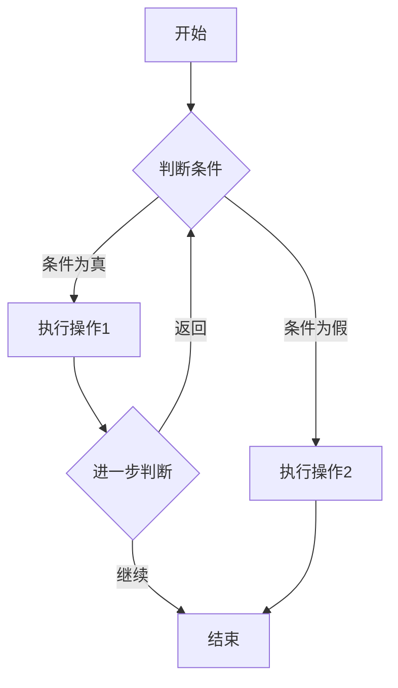
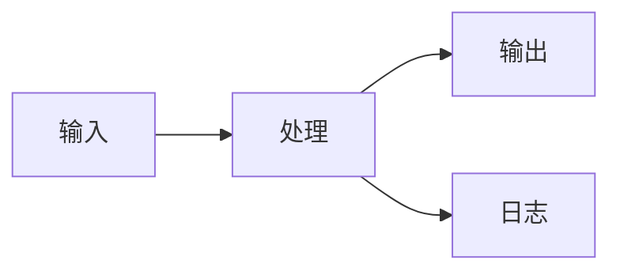
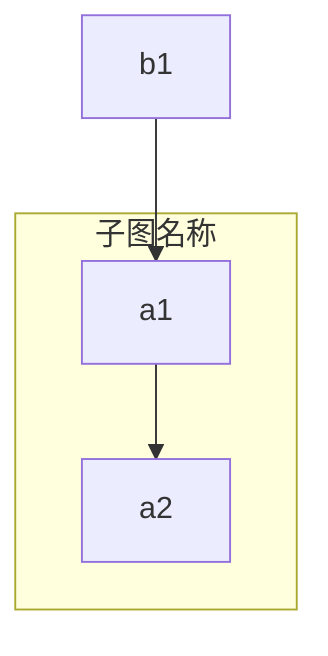

# 流程图 (Flowchart)

## 图示说明
流程图是一种用于表示工作流程或过程的图示，通过节点（形状）和连接线来展示程序的执行流程或业务的流转过程。

## 适用范围
- 业务流程梳理与可视化
- 程序执行流程说明
- 决策逻辑展示
- 组织架构展示
- 问题解决步骤说明

## 语法示例





## 语法说明

### 方向设置
- `TD` / `TB` (Top-Down): 从上到下
- `BT` (Bottom-Top): 从下到上
- `LR` (Left-Right): 从左到右
- `RL` (Right-Left): 从右到左

### 节点形状
- `[文本]`: 矩形（默认）
- `([文本])`: 圆角矩形
- `([[文本]])`: 圆柱形（数据库）
- `[(文本)]`: 椭圆形（圆形）
- `{文本}`: 菱形（决策）
- `{{文本}}`: 六边形
- `[[文本]]`: 带括号的矩形
- `[(文本)]`: 圆柱形
- `>文本]`: 旗帜形

### 连接线样式
- `-->`: 实线箭头
- `---`: 实线无箭头
- `-.->`: 虚线箭头
- `==>`: 粗箭头
- `--o`: 线与圆
- `--x`: 线与叉

### 链接文本
- `A -->|文本| B`: 在连线上添加文本标签

### 子图


## 配置说明

### flowchart 特有的配置选项

| 配置项 | 说明 | 可选值 |
|--------|------|--------|
| curve | 连接线曲线样式 | linear, basis, cardinal |
| padding | 节点内边距 | 数字 |
| nodeSpacing | 节点间距 | 数字 |
| rankSpacing | 层级间距 | 数字 |
| fontFamily | 字体 | 字符串 |
| fontSize | 字体大小 | 数字 |

### 样式类
```mermaid
flowchart TD
    A --> B
    class A style fill:#f9f,stroke:#333,stroke-width:4px
    class B classDef highlight fill:#ff9,stroke:#f66,stroke-width:2px
```
