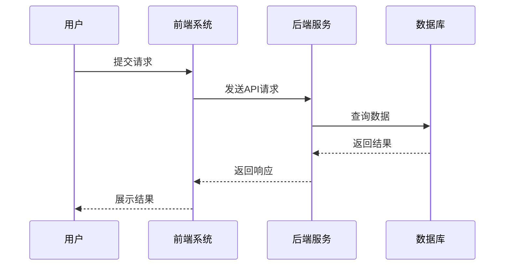
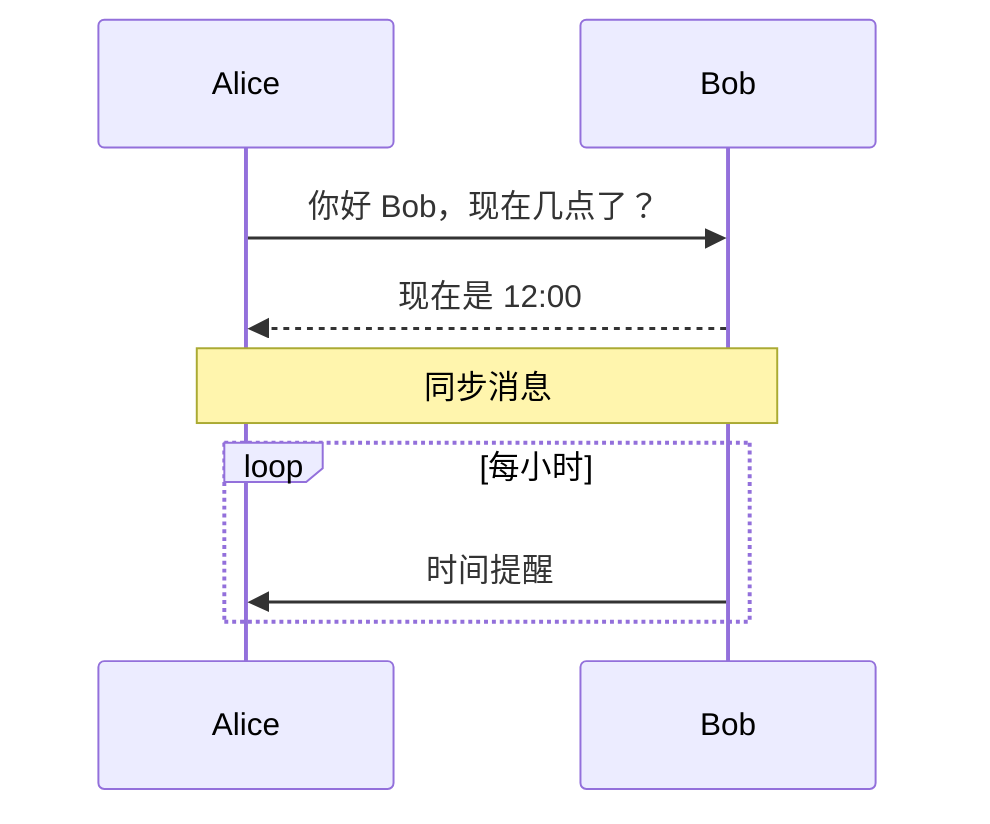
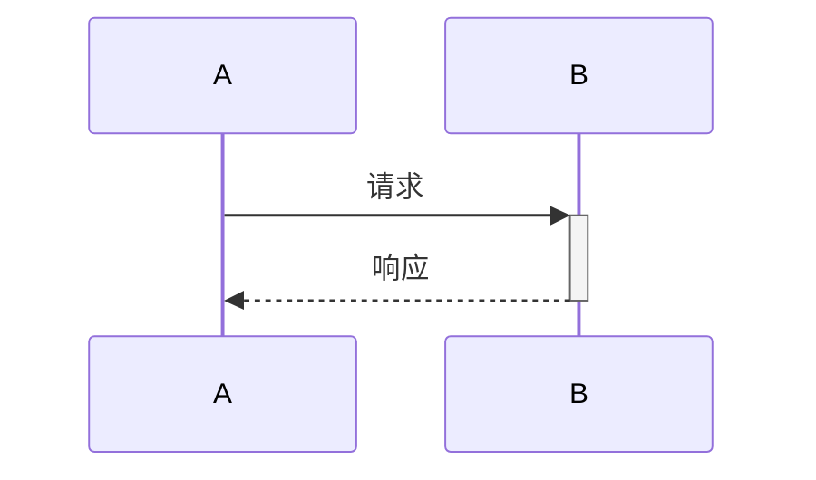

# 时序图 (Sequence Diagram)

## 图示说明
时序图用于展示对象之间按照时间顺序进行的交互过程，常用于描述系统中不同组件或用户之间的消息传递和响应顺序。

## 适用范围
- 系统交互设计说明
- API 调用流程展示
- 用户与系统交互过程
- 微服务调用链路
- 复杂业务逻辑解释

## 语法示例





## 语法说明

### 基本元素
- `participant 名称`: 定义参与者
- `->>`: 发送消息（实线实心箭头）
- `-->>`: 返回消息（虚线实心箭头）
- `->`: 发送消息（实线）
- `-->`: 返回消息（虚线）

### 特殊消息类型
- `-)` 或 `--)`: 创建异步消息
- `->>` 或 `-->>`: 同步消息

### 注释语法
- `Note [位置] [参与者]: 注释内容`
- 位置: `over`, `left of`, `right of`
- `Note over Alice,Bob`: 跨越多个参与者的注释

### 控制结构
```mermaid
loop 循环条件
    ... 消息 ...
end

alt 条件1
    ... 消息 ...
else 条件2
    ... 消息 ...
else
    ... 默认情况 ...
end

opt 可选
    ... 消息 ...
end
```

### 激活/停用参与者

使用 `+` 激活参与者，`-` 停用参与者

## 配置说明

| 配置项 | 说明 |
|--------|------|
| mirrorActors | 是否在底部显示参与者 |
| actorMargin | 参与者间距 |
| messageMargin | 消息间距 |
| boxMargin | 框体边距 |
| noteMargin | 注释边距 |
| activationWidth | 激活条宽度 |
| bottomMargin | 底部边距 |

### 样式配置
```mermaid
sequenceDiagram
    sequenceStyle hand
    autoNumber on
```
