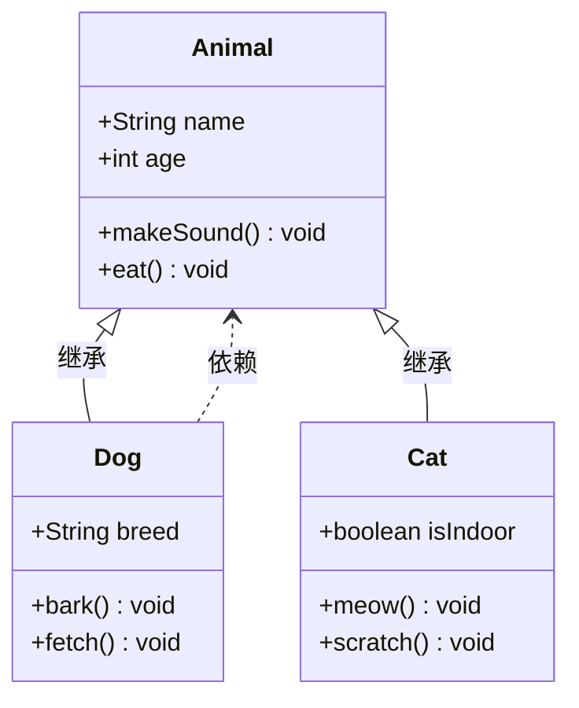
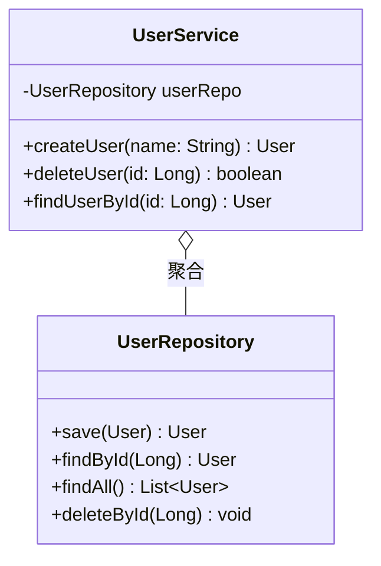
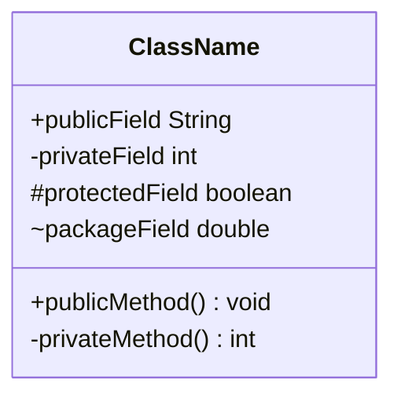
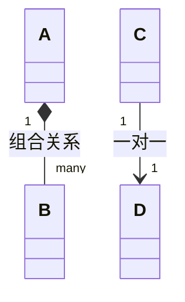
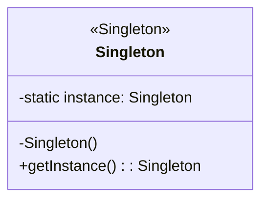

# 类图 (Class Diagram)

## 图示说明
类图是面向对象编程中用于展示类、类的属性、方法和类之间关系的图示。是 UML（统一建模语言）中最常用的图示之一。

## 适用范围
- 软件架构设计
- 代码结构说明
- 对象关系建模
- API 接口设计
- 数据库表结构设计

## 语法示例





## 语法说明

### 类声明


### 访问修饰符
- `+`: public（公有）
- `-`: private（私有）
- `#`: protected（受保护）
- `~`: package（包级别）

### 关系类型
- `<|--`: 继承（泛化）
- `*--`: 组合
- `o--`: 聚合
- `-->`: 关联
- `..>`: 依赖
- `..|>`: 实现（接口）

### 关系标签


### 接口和抽象类
```mermaid
classDiagram
    interface Printable {
        <<interface>>
        +print() void
    }

    class Document {
        <<abstract>>
        +print() void
    }

    Document ..|> Printable : 实现
```

### 类注解


## 配置说明

| 配置项 | 说明 |
|--------|------|
| showClassMembers | 显示类成员 |
| defaultMemberAlignment | 成员对齐方式 |
| nodeSpacing | 节点间距 |
| rankSpacing | 层级间距 |

### 关系样式
```mermaid
classDiagram
    style A fill:#f9f,stroke:#333,stroke-width:2px
```
