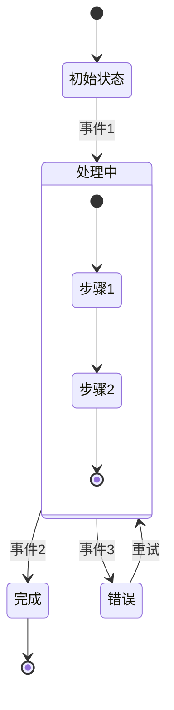
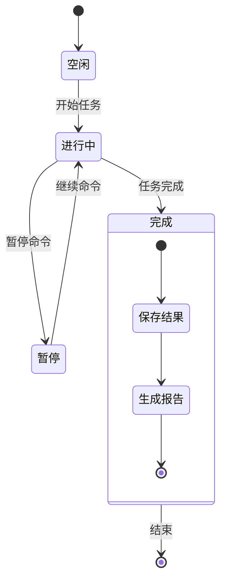
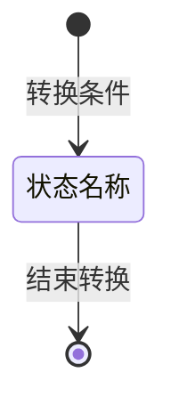
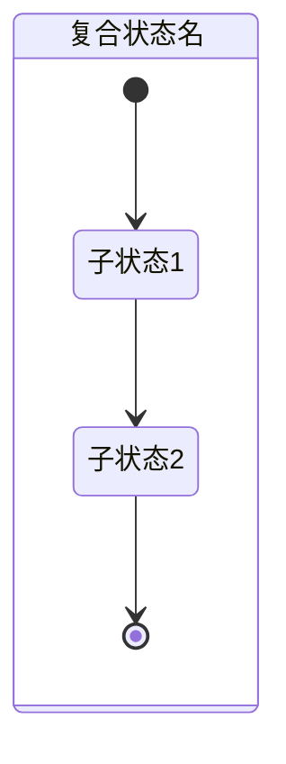
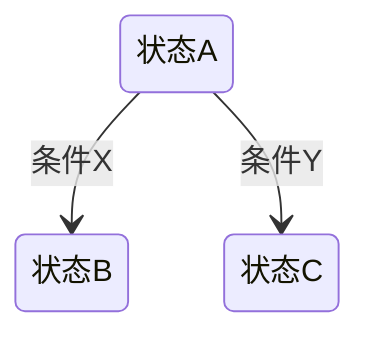
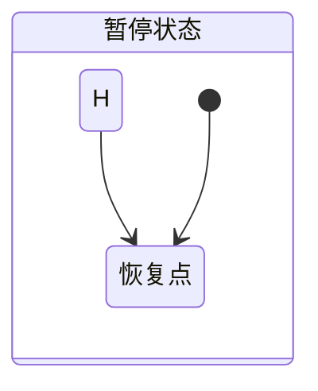

# 状态图 (State Diagram)

## 图示说明
状态图用于描述一个对象或系统在其生命周期内所经历的各种状态，以及导致状态转换的事件或条件。

## 适用范围
- 对象状态管理设计
- 状态机建模
- 业务流程状态流转
- 协议状态机
- UI 组件状态管理

## 语法示例





## 语法说明

### 基本语法


### 复合状态


### 条件判断


### 特殊标记
- `[*]`: 开始或结束状态
- `state xxx`: 普通状态定义
- `state xxx { ... }`: 复合状态

### 历史状态


## 配置说明

| 配置项 | 说明 |
|--------|------|
| showNullElements | 显示空元素 |
| hideEmptyDescription | 隐藏空描述 |
| fork/join | 分叉/汇合支持 |

### 样式
```mermaid
stateDiagram
    [*] --> 状态1
    状态1: 这是状态描述

    classDef active fill:#f96
    class 状态1 active
```
