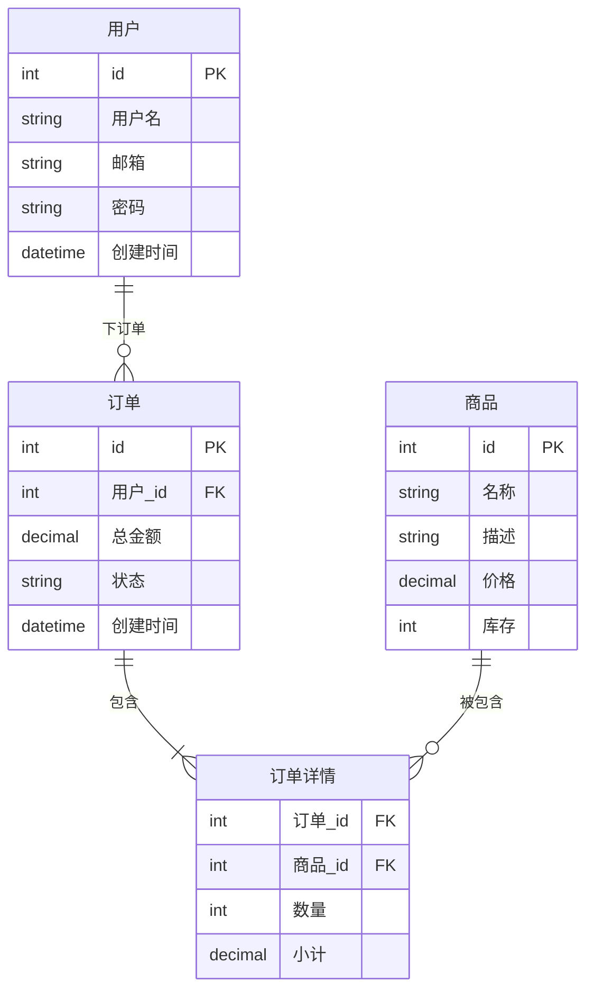
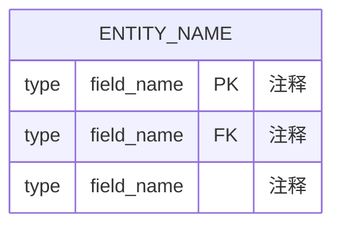
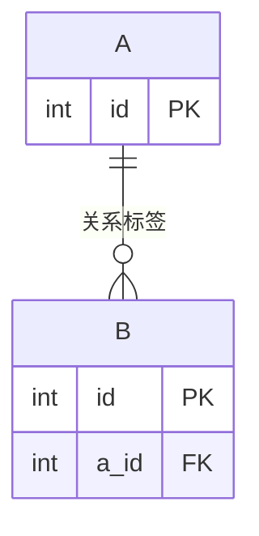
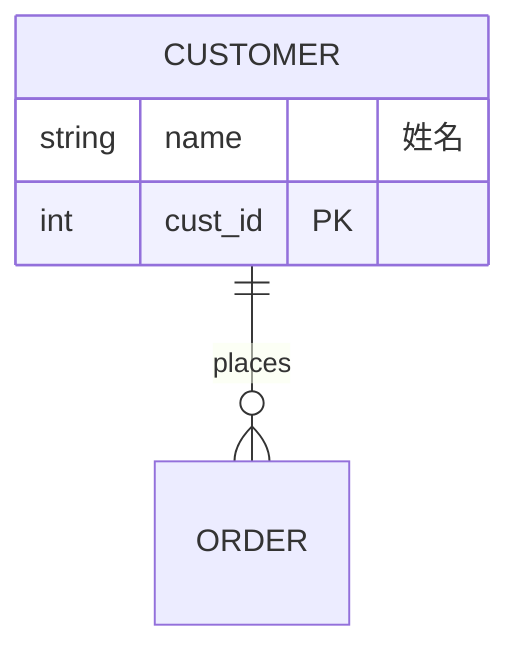

# 实体关系图 (Entity Relationship Diagram)

## 图示说明
实体关系图用于表示数据库中的实体、它们的属性以及实体之间的关系。是数据库设计和建模的重要工具。

## 适用范围
- 数据库设计
- 数据建模
- 业务数据关系梳理
- API 数据结构设计
- 系统集成数据映射

## 语法示例

## 语法说明

### 基本语法

### 字段类型
- `int`, `string`, `boolean`, `datetime`, `decimal`, `float`

### 字段修饰符
- `PK`: 主键 (Primary Key)
- `FK`: 外键 (Foreign Key)
- `UK`: 唯一键 (Unique Key)
- `NN`: 非空 (Not Null)

### 关系符号

| 符号 | 说明 |
|------|------|
| `||` | 恰好一个 |
| `o|` | 零或一个 |
| `}|` | 一个或多个 |
| `o{` | 零或多个 |
| `||--||` | 一对一 |
| `||--o{` | 一对多 |
| `}|--||` | 多对一 |
| `}|--o{` | 多对多 |

### 关系标签

## 配置说明

| 配置项 | 说明 |
|--------|------|
| showEntityTypes | 显示实体类型 |
| entitySeparation | 实体间距 |
| relationshipSeparation | 关系间距 |

### 样式配置

