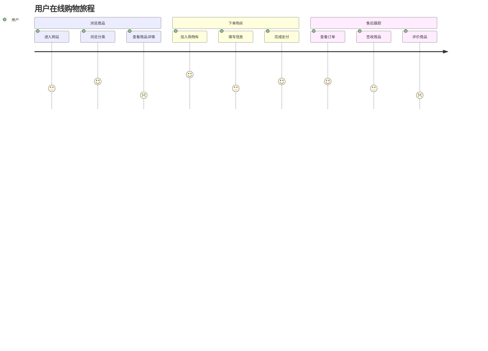
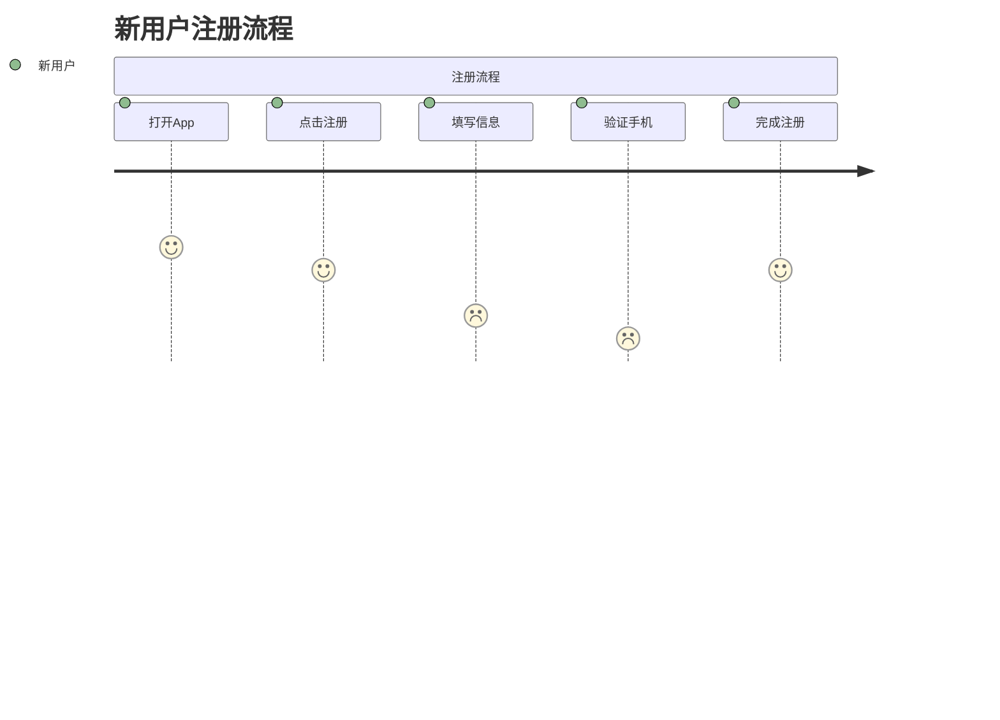
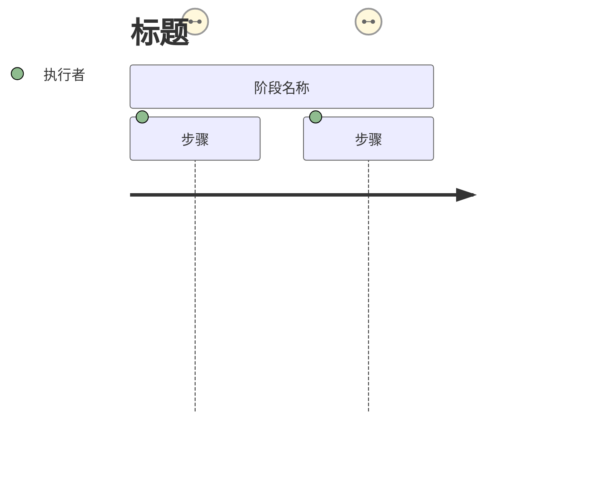
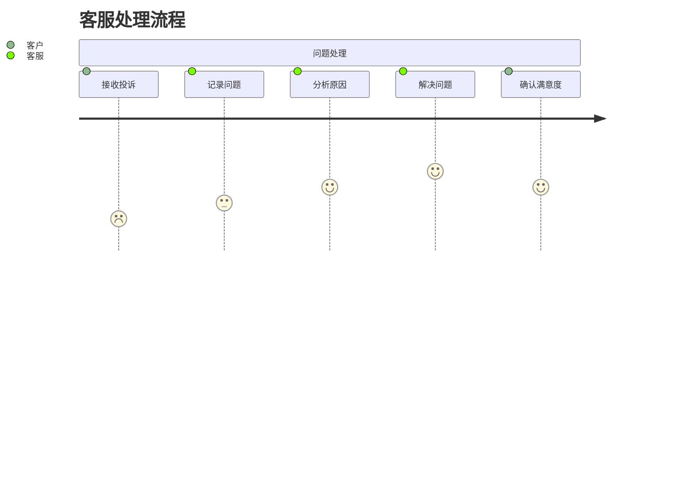

# 用户旅程图 (User Journey)

## 图示说明
用户旅程图用于展示用户在完成某个目标过程中所经历的步骤、情感变化和触点。帮助团队理解用户与产品/服务交互的全过程。

## 适用范围
- 用户体验设计
- 业务流程优化
- 客户服务改进
- 产品功能规划
- 用户研究展示

## 语法示例





## 语法说明

### 基本结构


### 评分系统
- 评分范围: 1-5
- 1: 非常不满意 / 痛苦
- 2: 不满意
- 3: 中立 / 一般
- 4: 满意
- 5: 非常满意 / 愉快

### 语法详解
- `title`: 旅程图标题
- `section`: 定义一个阶段/步骤组
- `步骤名称`: 具体动作描述
- `评分`: 满意度或重要性评分
- `执行者`: 执行该动作的用户角色

### 多角色旅程


## 配置说明

| 配置项 | 说明 |
|--------|------|
| showShadow | 显示阴影效果 |
| journeyWrap | 步骤文字换行 |

### 样式自定义
```mermaid
journey
    title 示例
    style 步骤1 fill:#f9f,stroke:#333
```
