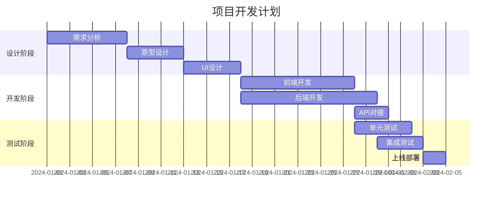
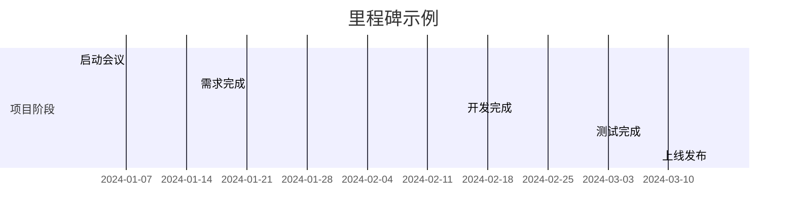
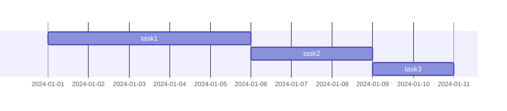
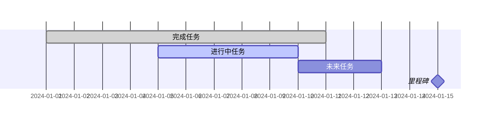

# 甘特图 (Gantt)

## 图示说明
甘特图是一种条形图，用于展示项目进度、时间安排和任务依赖关系。横轴表示时间，纵轴表示任务或项目组成部分。

## 适用范围
- 项目管理进度展示
- 任务时间规划
- 资源调配可视化
- 里程碑追踪
- 生产计划排程

## 语法示例





## 语法说明

### 基本语法
```mermaid
gantt
    title 标题
    dateFormat 日期格式
    section 分组名称
        任务名称: 任务ID, 开始日期, 持续时间
```

### 日期格式
- `YYYY-MM-DD`: 2024-01-15
- `YYYY-MM-DD HH:mm`: 2024-01-15 09:00
- `DD/MM/YYYY`: 15/01/2024
- `MM-DD`: 01-15（当年）

### 持续时间表示
- `7d`: 7天
- `3w`: 3周
- `2m`: 2个月
- `10h`: 10小时
- `30m`: 30分钟

### 任务依赖


### 关键任务和里程碑


### 任务状态
- `done`: 已完成（深色）
- `active`: 进行中（彩色）
- `crit`: 关键任务（红色边框）
- 默认: 未来任务（浅色）

## 配置说明

| 配置项 | 说明 |
|--------|------|
| title | 图表标题 |
| dateFormat | 日期格式 |
| axisFormat | 时间轴格式 |
| sectionSeparator | 分组分隔符 |
| inclusiveEndDates | 结束日期包含性 |

### 时间轴格式
```mermaid
gantt
    dateFormat YYYY-MM-DD
    axisFormat %m/%d
```
