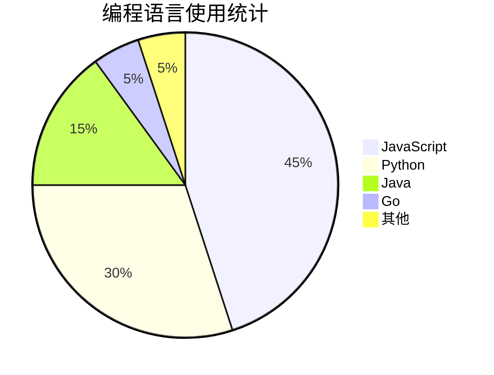
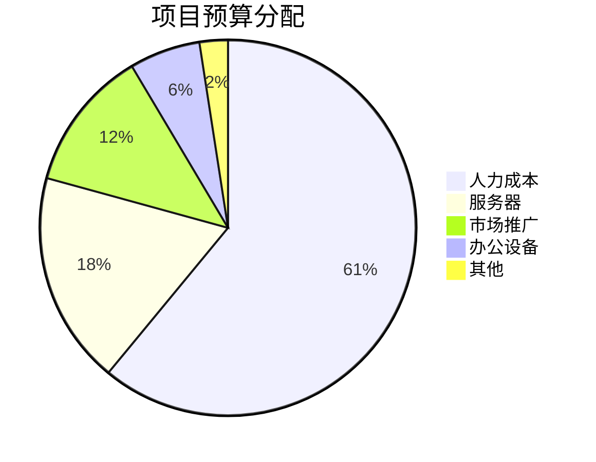
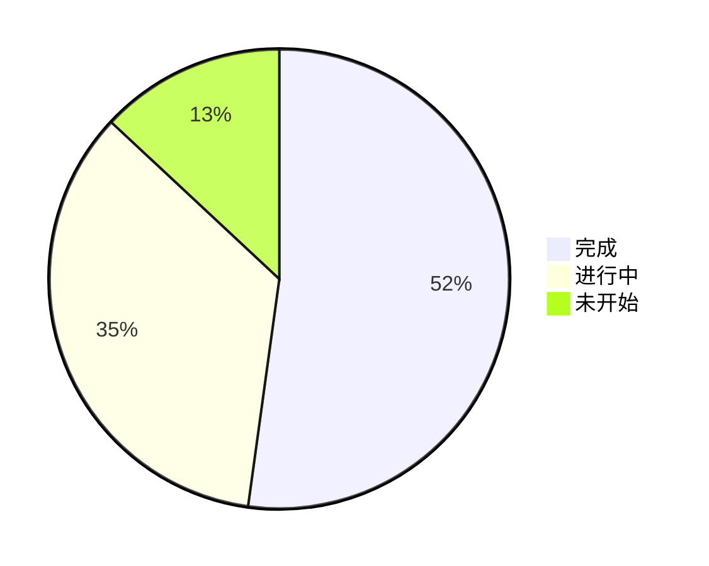
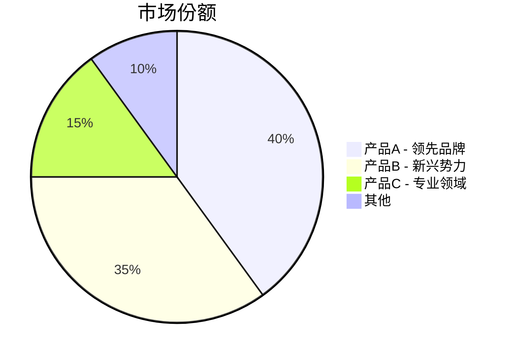

# 饼图 (Pie Chart)

## 图示说明
饼图是一种圆形图，用于展示各部分占总体的比例关系。通过扇形的大小来直观显示不同类别的占比。

## 适用范围
- 占比分析展示
- 调查结果分布
- 资源分配比例
- 预算分配
- 分类统计

## 语法示例

## 语法说明

### 基本语法

### 标签格式
- 可以使用引号包裹的字符串
- 数值可以是整数或小数
- 数值会自动计算百分比

### 特殊值处理

### 带说明的饼图

## 配置说明

### 样式选项

### 图例位置
Mermaid 饼图默认在右侧显示图例。

### 颜色自定义
可以使用 CSS 样式或 Mermaid 的 `style` 指令来设置每个扇形的颜色。

### 注意事项
- 饼图适合展示少量分类（3-7个）
- 分类过多会导致难以阅读
- 各部分数值应为正数
