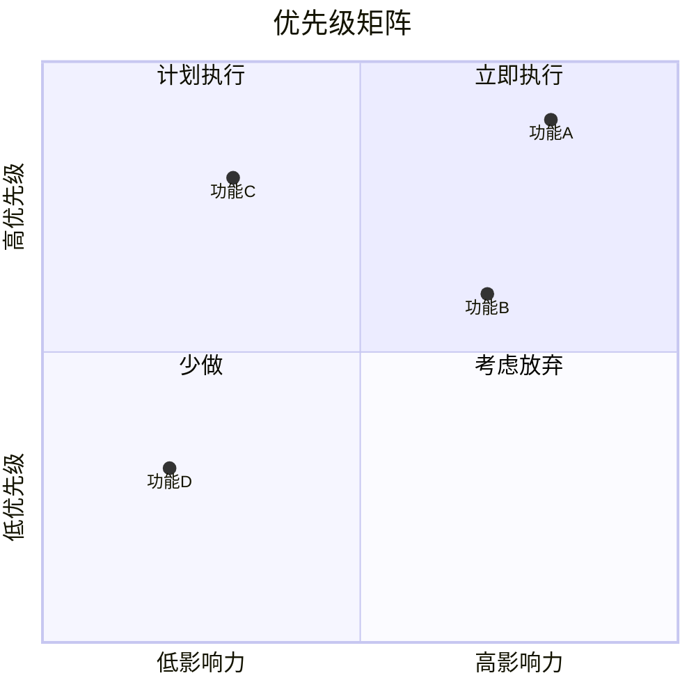
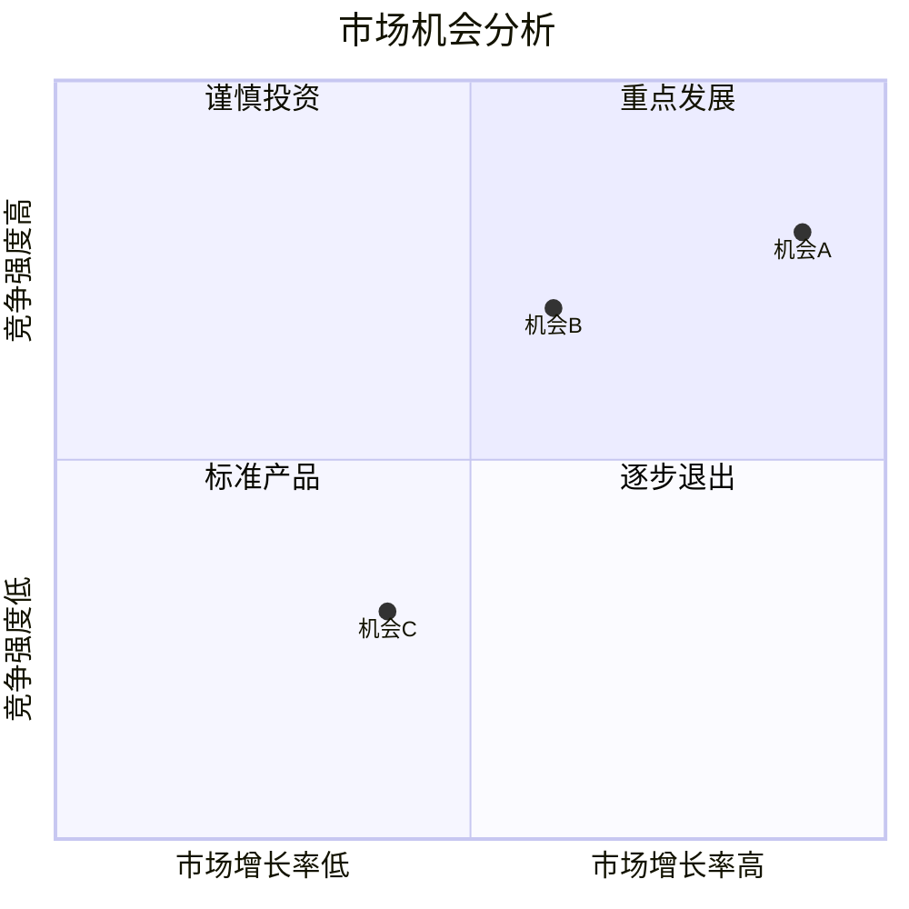

# 象限图 (Quadrant)

## 图示说明
象限图是一种将平面分成四个区域的图表，用于根据两个维度的评分对项目、想法或选项进行分类和优先级排序。

## 适用范围
- 优先级矩阵分析
- 产品功能规划
- 策略分析
- 影响力/难度评估
- SWOT 分析可视化

## 语法示例





## 语法说明

### 基本语法
```mermaid
quadrantChart
    title 图表标题
    x-axis 标签1 --> 标签2
    y-axis 标签1 --> 标签2
    quadrant-1 区域1名称
    quadrant-2 区域2名称
    quadrant-3 区域3名称
    quadrant-4 区域4名称
    "数据点1": [x值, y值]
    "数据点2": [x值, y值]
```

### 坐标系统
- X 轴: 从左到右，值从 0 到 1
- Y 轴: 从下到上，值从 0 到 1
- 四个象限按逆时针方向编号：
  - Q1 (quadrant-1): 右上
  - Q2 (quadrant-2): 左上
  - Q3 (quadrant-3): 左下
  - Q4 (quadrant-4): 右下

### 轴标签
- 使用 `-->` 分隔两个端点
- 左/下为低，右/上为高

### 数据点格式
```mermaid
quadrantChart
    "点名称": [x坐标, y坐标]
```
- 坐标值范围建议在 0.1-0.9 之间
- 不要使用 0 或 1，可能会落在轴线上

## 配置说明

### 象限颜色
可以通过主题配置修改象限背景色。

### 图表大小
使用 `width` 和 `height` 参数控制图表尺寸。

### 注意事项
- 数据点数量适中（建议不超过 12 个）
- 合理分配数据点位置
- 象限标签应简洁明了
