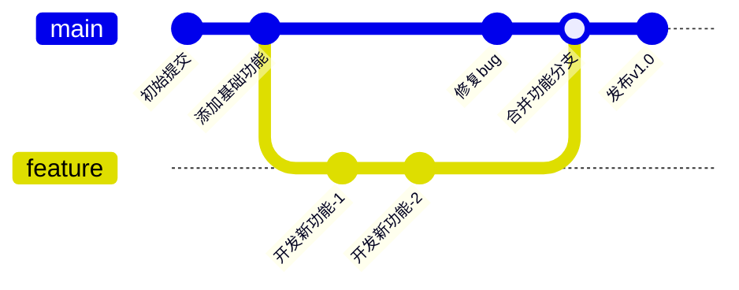
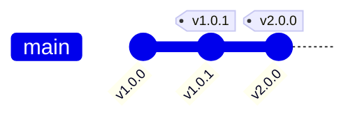

# Git 图表 (Git Graph)

## 图示说明
Git 图表用于可视化展示 Git 仓库的提交历史、分支和合并情况。帮助理解项目的版本演进和分支策略。

## 适用范围
- Git 仓库历史展示
- 分支策略说明
- Pull Request 流程说明
- 合并冲突分析
- 发布版本追踪

## 语法示例



```mermaid
gitGraph
    commit id: "初始化项目"
    commit id: "添加README"
    branch develop
    checkout develop
    commit id: "功能开发-1"
    commit id: "功能开发-2"
    branch feature-xyz
    checkout feature-xyz
    commit id: "XYZ功能开发"
    checkout develop
    merge feature-xyz id: "合并XYZ"
    checkout main
    merge develop id: "发布版本"
    commit id: "Hotfix修复"
    merge main id: "合并修复"
```

## 语法说明

### 基本语法


### 提交
- `commit`: 创建提交（带自动 ID）
- `commit id: "说明"`: 创建带 ID 和说明的提交

### 分支操作
- `branch 名称`: 创建新分支
- `checkout 名称`: 切换到指定分支
- `cherry-pick 提交ID`: 摘取特定提交

### 合并操作
- `merge 名称`: 合并分支到当前分支
- `merge 名称 id: "合并说明"`: 带说明的合并

### 标签


### Rebase


## 配置说明

| 配置项 | 说明 |
|--------|------|
| showCommitLabel | 显示提交标签 |
| mainBranchName | 主分支名称 |
| mainBranchOrder | 主分支排序 |
| showBranches | 显示分支 |
| mode | 图形模式 |

### 主题配置

