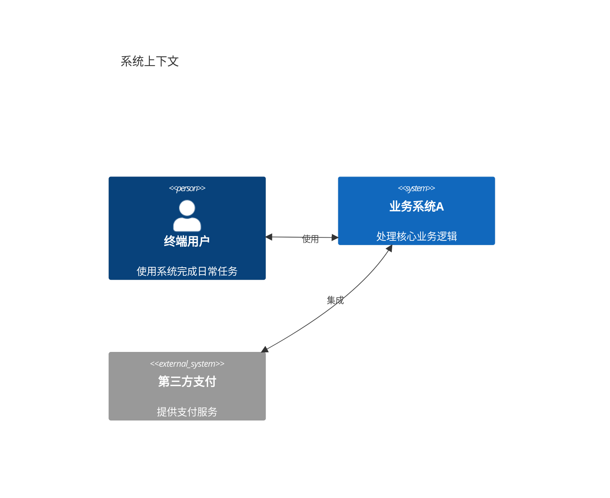
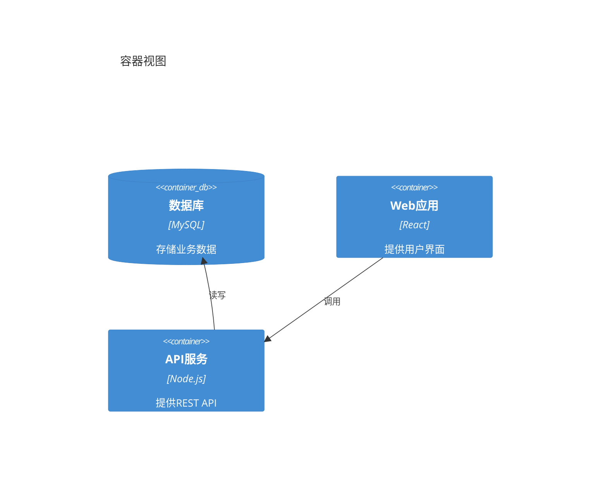

# C4 图表 (C4 Diagram)

## 图示说明
C4 图表是一种用于可视化软件架构的图示方法，通过不同层次的抽象（Context、Container、Component、Code）来描述系统的架构。

## 适用范围
- 软件架构文档
- 系统上下文展示
- 容器/服务划分
- 组件设计说明
- 技术栈说明

## 语法示例





## 语法说明

### 层次结构
1. **Context (上下文)**: 系统全景视图
2. **Container (容器)**: 应用和技术选择
3. **Component (组件)**: 组件和职责
4. **Code (代码)**: 具体实现细节

### 元素类型
- `Person`: 人员角色
- `System`: 内部系统
- `System_Ext`: 外部系统
- `Container`: 容器/应用
- `ContainerDb`: 数据库容器
- `Component`: 组件

### 关系类型
- `Rel`: 双向关系
- `BiRel`: 双向关系（简化）
- `Rel_U`: 向上关系
- `Rel_D`: 向下关系
- `Rel_L`: 向左关系
- `Rel_R`: 向右关系

### 布局选项
```mermaid
C4Context
    layout陪你
    Person(p1, "用户1")
    Person(p2, "用户2")
```

## 配置说明

### C4Context 配置
```mermaid
C4Context
    title 标题
    layout陪你
```

### 样式选项
支持自定义边界颜色、背景色等样式属性。

### 注意事项
- C4 是实验性功能，语法可能变更
- 建议查看官方文档获取最新语法
