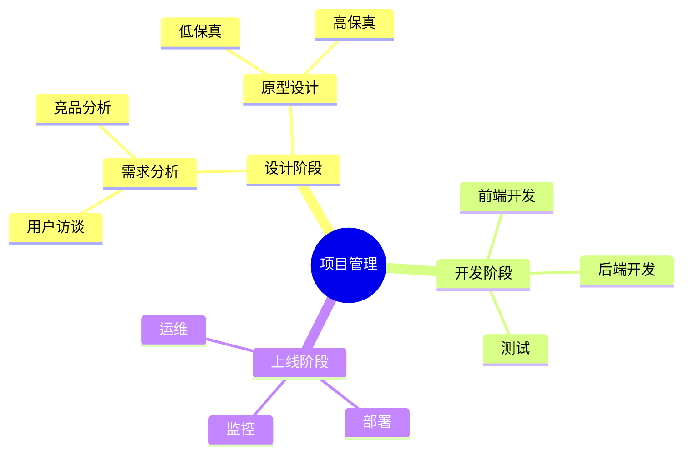
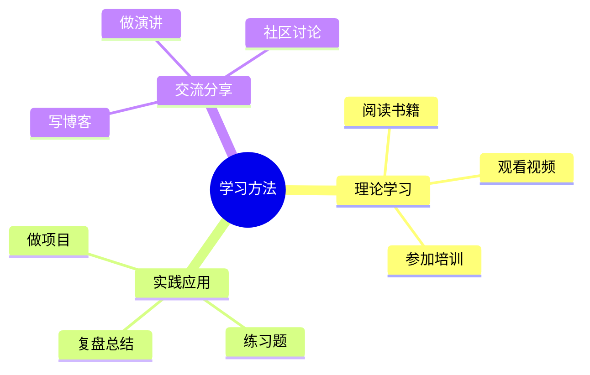
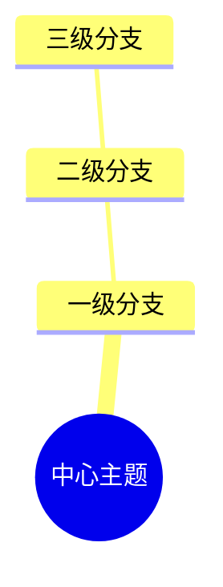
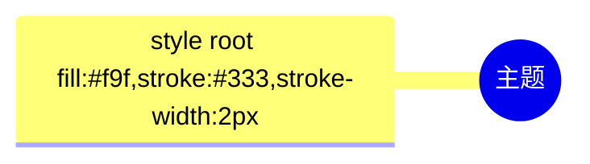

# 思维导图 (Mindmap)

## 图示说明
思维导图是一种放射状的结构图，用于以中心主题为核心，层层展开相关的想法、概念或信息。适合用于头脑风暴、笔记整理和知识梳理。

## 适用范围
- 头脑风暴
- 知识整理
- 项目规划
- 学习笔记
- 会议纪要

## 语法示例

## 语法说明

### 基本结构

### 节点层次
- `root((主题))`: 根节点，使用双括号
- 缩进表示层级关系
- 深层节点可以有更多细节

### 节点格式
- 普通节点: 直接写文字
- 根节点: 使用 `root((文字))`
- 巢状节点可以多层展开

### 布局方向
Mindmap 默认会自动布局，支持多个根节点的思维导图。

### 特殊符号
- 可以使用 emoji
- 可以使用中文和英文混排
- 文字较长时会自动换行

## 配置说明

### 样式配置

### 主题选项
- 可以配合 Mermaid 主题设置颜色
- 支持自定义节点颜色

### 注意事项
- 层级不宜过深（建议不超过 5 层）
- 同一层级节点数量适中
- 关键词优于长句子
