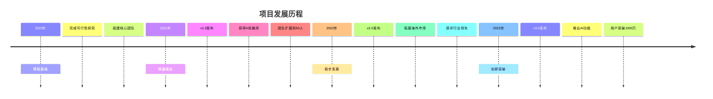
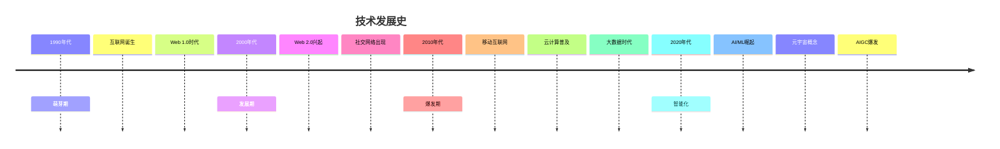
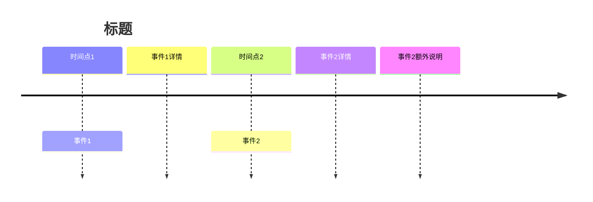
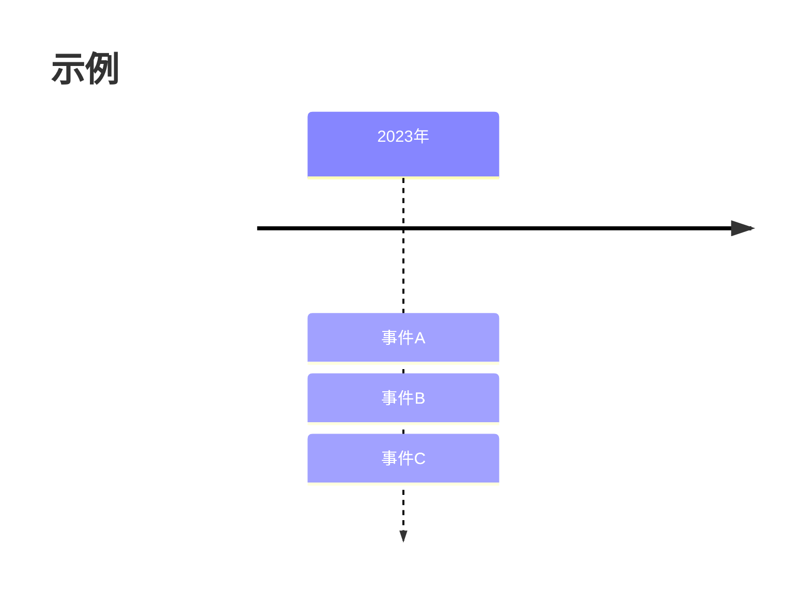

# 时间线图 (Timeline)

## 图示说明
时间线图用于按时间顺序展示事件序列，适合展示历史发展、项目进程或事件编年。

## 适用范围
- 历史事件展示
- 项目发展历程
- 公司/产品里程碑
- 个人履历
- 项目复盘

## 语法示例





## 语法说明

### 基本语法


### 时间点格式
- 年份: `2020`
- 年月: `2020-03`
- 具体日期: `2020-03-15`
- 时代: `1990年代`

### 事件层级
- 主事件: 冒号后的第一行
- 子事件: 缩进的详细说明

### 多事件并行


## 配置说明

### 样式选项
```mermaid
timeline
    title 示例
    sectionStyle 1 fill:#eaf
    sectionStyle 2 fill:#efe
```

### 主题支持
可以配合 Mermaid 主题配置颜色和样式。

### 注意事项
- 时间顺序很重要
- 事件数量适中
- 标签简洁明了
