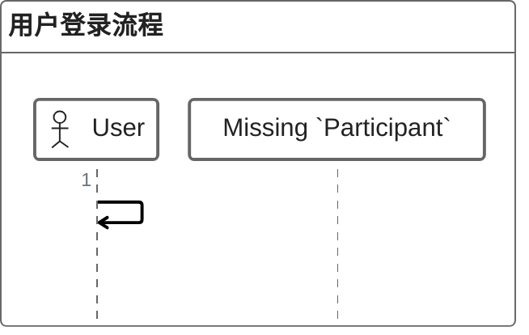
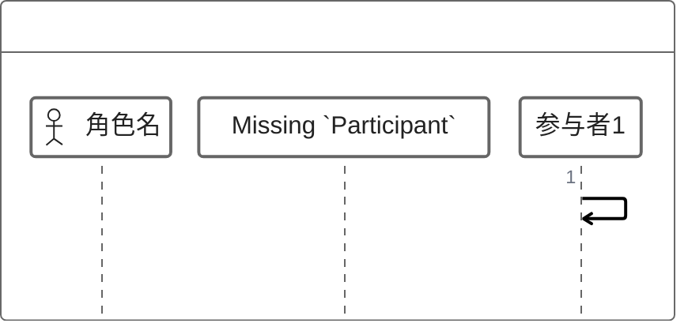
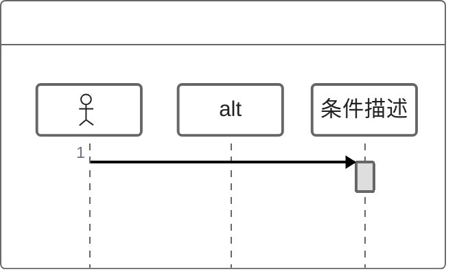
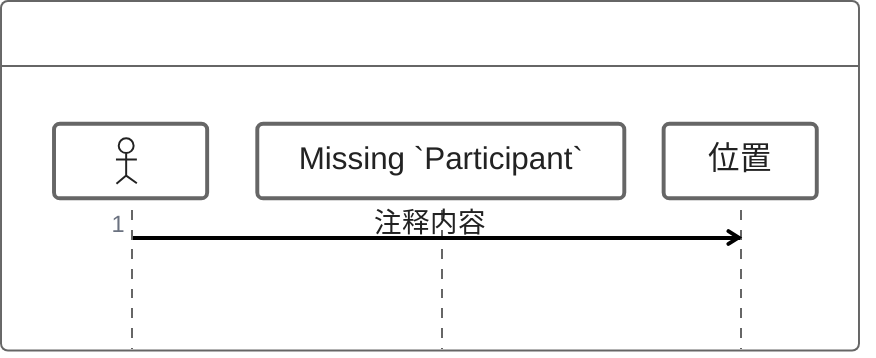

# ZenUML

## 图示说明
ZenUML 是一种用于绘制序列图的图示类型，采用简洁的文本描述来生成专业的序列图，特别注重代码与图表的一致性。

## 适用范围
- 核心流程描述
- API 调用展示
- 技术文档编写
- 架构设计说明
- 教学演示

## 语法示例

## 语法说明

### 基本语法

### 参与者声明
- `@Actor`: 定义角色
- `@Participants`: 开始定义参与者

### 消息类型
- `->>`: 同步消息（实线箭头）
- `-->>`: 返回消息（虚线箭头）
- `->"参与者"`: 发送消息给指定参与者

### 控制结构

### 注释

### 位置选项
- `over 参与者`: 在参与者上方
- `left of 参与者`: 在参与者左侧
- `right of 参与者`: 在参与者右侧

## 配置说明

### 样式配置
ZenUML 支持自定义颜色、字体等样式。

### 注意事项
- ZenUML 是实验性功能
- 语法可能与标准序列图有所不同
- 建议查看官方文档获取最新信息
