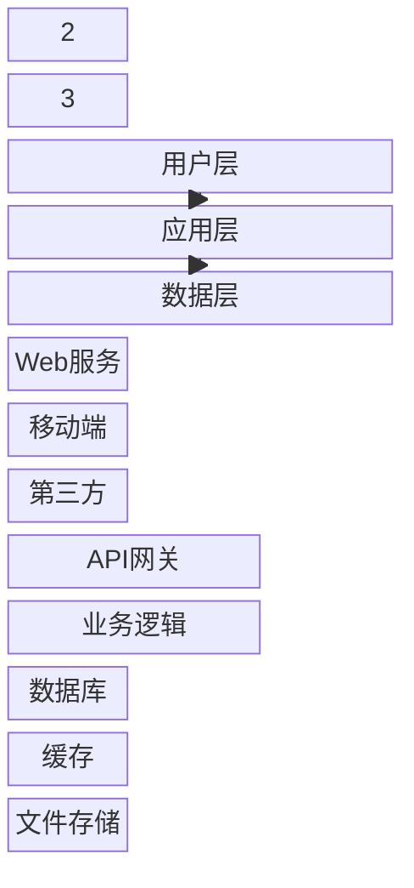

# 块图 (Block)

## 图示说明
块图是一种用于展示系统架构或组织结构的图示类型，通过方块和连接线来表示组件之间的关系和层次结构。

## 适用范围
- 系统架构展示
- 组织结构图
- 硬件架构
- 网络拓扑
- 模块关系

## 语法示例



```mermaid
block-beta
    title 云计算架构

    cloud["云服务"]:::cloudBox
    compute["计算服务"]
    storage["存储服务"]
    network["网络服务"]

    cloud --> compute
    cloud --> storage
    cloud --> network

    style cloud fill:#f9f,stroke:#333
    classDef cloudBox fill:#e1f5fe
```

## 语法说明

### 基本语法
```mermaid
block-beta

    A["标签"]: 宽度比例
    B["标签"]
    C["标签"]

    A --> B
    B --> C
```

### 布局
- `columns`: 定义列数和比例
- 可以设置不同宽度的块

### 块类型


### 块形状
- `[]`: 矩形
- `[[]]`: 文档形
- `[()]`: 圆柱形
- `{{}}`: 六边形

### 特殊块


## 配置说明

### 样式类

```mermaid
block-beta
    A["标签"]

    classDef custom fill:#f9f,stroke:#333,stroke-width:2px
    class A custom
```


### 注释和标签
```mermaid
block-beta
    A["组件A"]
    B["组件B"]

    A -.- B: 依赖关系
```

### 注意事项
- Block 是相对较新的图示类型
- 部分语法可能仍在演进中
