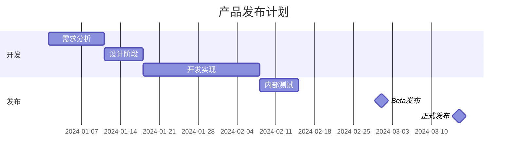
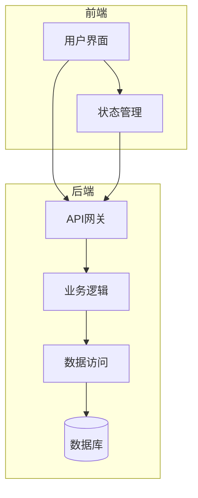
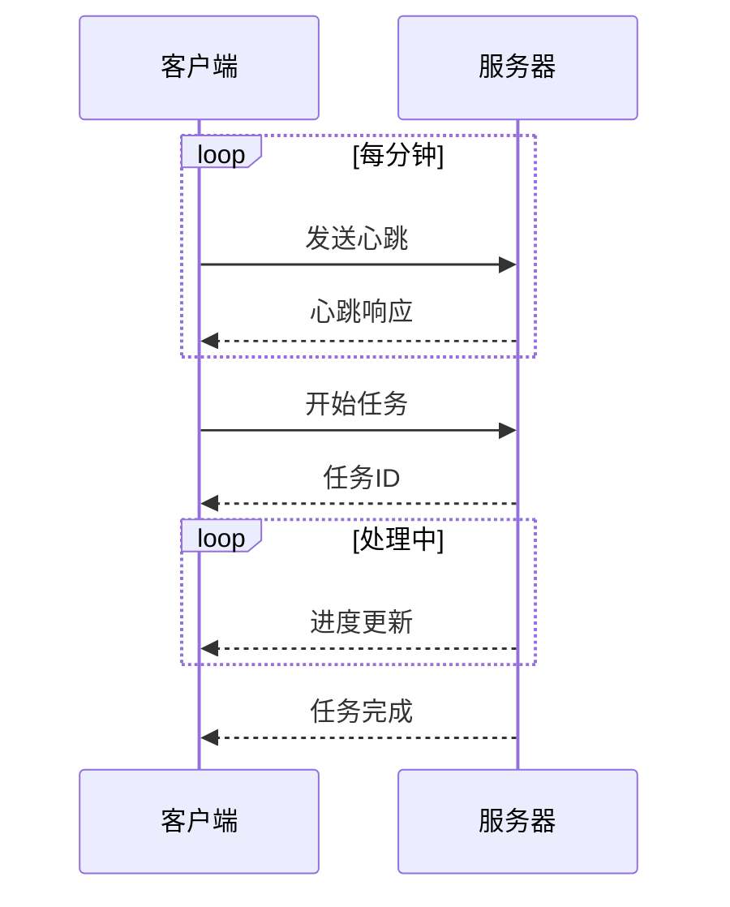
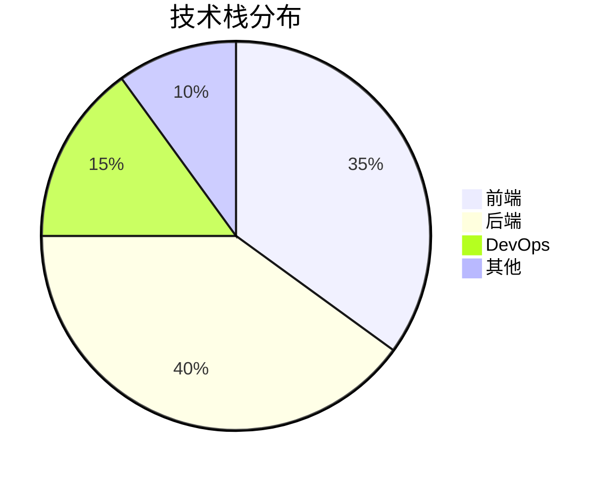
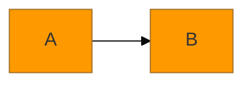
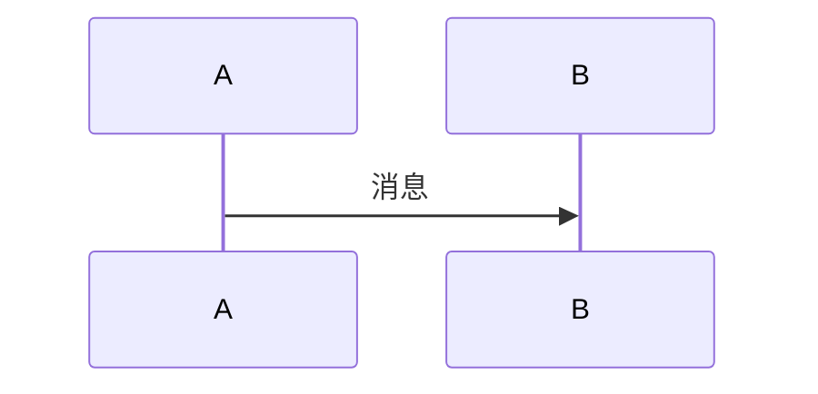
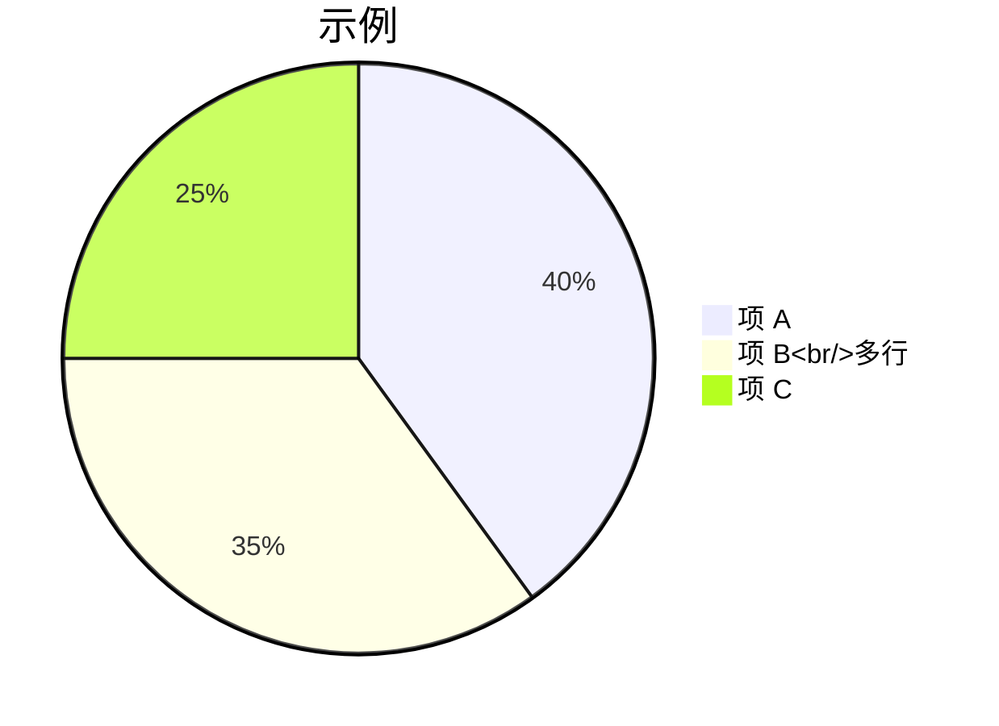
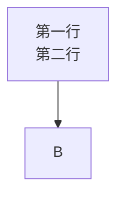
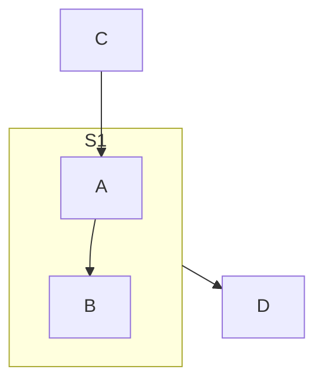
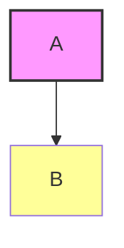

# 其他示例 (Other Examples)

## 图示说明
本章节汇总一些不属于标准类别的特殊图示类型和使用技巧，以及 Mermaid 的高级用法。

## 语法示例

### 甘特图与里程碑



### 复合流程图



### 时序图与循环



### 多个图的组合展示



## Mermaid 配置与主题

### Mermaid 主题设置

````markdown

````

### 常用主题
- `default`: 默认主题
- `base`: 基础主题
- `dark`: 暗色主题
- `forest`: 森林主题
- `neutral`: 中性主题

## Mermaid 扩展语法

### Markdown 中的 Mermaid

可以在 Markdown 文档中直接嵌入 Mermaid 图：

````markdown
这是一段文字说明。


````

### Mermaid 中的 HTML

部分 Mermaid 类型支持 HTML 格式的文本：



## 常见问题与技巧

### 1. 文本换行


### 2. 特殊字符转义
使用引号包裹包含特殊字符的文本。

### 3. 子图引用


### 4. CSS 样式


## 参考资源

- [Mermaid 官方文档](https://mermaid.js.org/)
- [Mermaid Live Editor](https://mermaid.live/)
- [Mermaid GitHub](https://github.com/mermaid-js/mermaid)

## 注意事项

- 部分图示类型（如 C4、ZenUML、Sankey、Architecture）是实验性功能
- 实验性功能的语法可能随版本更新变化
- 建议在正式环境中使用前验证语法
- Mermaid 版本更新可能带来新的图示类型和语法
